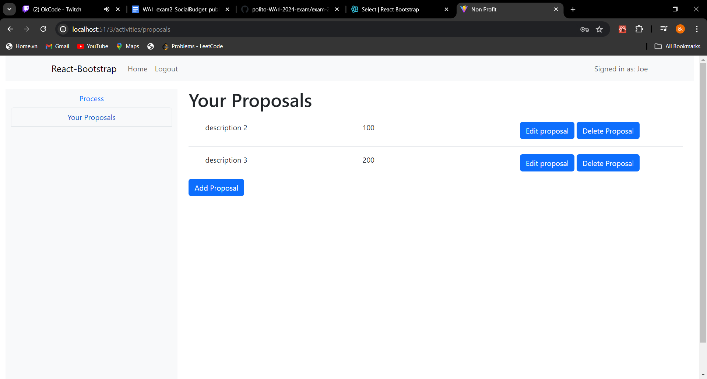
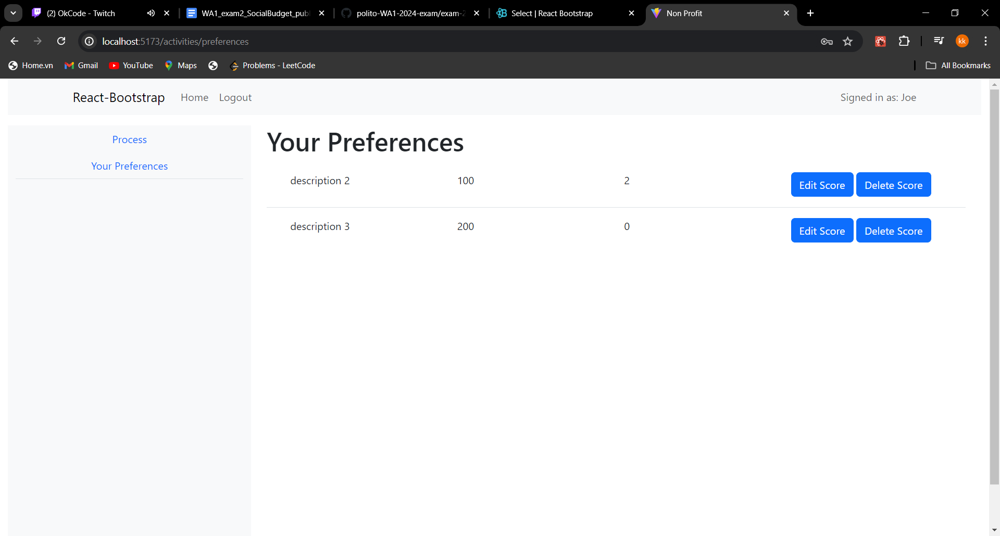

# Exam #N: "Social Budget"
## Student: s334001 MINH THAI MAI 

## React Client Application Routes

- Route `/`: Homepage, show homepage of the app
- Route `/login`: Page for user to login
- Route `/activities`: A wraper for other route
- Route `/activities/process`: To define new budget, move to next phase (for admin only)
- Route `/activities/proposals`: To view, add, edit, delete proposals (for member only)
- Route `/activities/preferences`: TO view, add, edit, delete preferences (for member only)
- Route `/activities/approved`: To view all approved activities (for everyone), and non-approved activities (for member only) 

## Main React Components

- `NavBar` (in `NavBar.jsx`): a navbar, with login/logout and go to home button
- `SideBar` (in `SideBar.jsx`): to navigate to different route
- `LoginForm`(in `LoginFrom.jsx`): to login user
- `ProcessLayout` (in `ProcessLayout.jsx`): to view and create new process
- `ProposalForm` (in `ProposalFrom.jsx`): to create, edit proposal
- `PreferenceForm` (in `PreferenceFrom.jsx`): to create, edit preference
- `ProposalLayout` (in `ProposalLayout.jsx`): Show list of proposals
- `PreferenceLayout` (in `PreferenceLayout.jsx`): Show list of preferences
- `ActivitiesLayout` (in `ActivitieLayout.jsx`): show list of activities

(only _main_ components, minor ones may be skipped)

## API Server

### User

- POST `/api/sessions`: login an user
  - request parameters: none.
  - request body content:
    - username: a string. 
    - password: a string.
  - response body content:
    - username: a string.
    - name: a string.
    - role: a string (either ADMIN or MEMBER).
  - response status codes and possible errors.
    - 401 if either username or password is wrong.
- GET `/api/sessions/current`: get information about the login user.
  - request parameters and request body content: none.
  - response body content:
    - username: a string.
    - name: a string.
    - role: a string (either ADMIN or MEMBER).
  - response status codes and possible errors.
    - 401 if user is not login.
- DELETE `/api/sessions`: logout an user
  - request parameters and request body content: none.
  - response body content: none.
  - response status codes and possible errors.
    - 401 if user is not login.

### Process

- POST `/api/process`: Create a process
  - request parameters: none.
  - request body content:
    - budget: a number
  - response body content: none
  - response status codes and possible errors: 200 if success, 401 unauthorized, 500 internal server error.
- GET `/api/process`: get info about current process
  - request parameters: none
  - response body content: 
    - phase: current phase of the process.
    - budget: defined budget
  - response status codes and possible errors: 200 if success, 401 unauthorized, 500 internal server error.
- PUT `/api/process`: update process phase
  - request parameters and request body content: none
  - response body content: none
  - response status codes and possible errors: 200 if success, 401 unauthorized, 500 internal server error.
- PUT `/api/process/aproved`: compute the list of approved proposals
  - request parameters and request body content: none
  - response body content: none
  - response status codes and possible errors: 200 if success, 401 unauthorized, 500 internal server error.
- DELETE `/api/process`: restart the process
  - request parameters: none
  - request body content: none
  - response body content: none
  - response status codes and possible errors: 200 if success, 401 unauthorized, 500 internal server error.

### Proposal

- POST `/api/proposals`: Create a proposal
  - request parameters: none.
  - request body content:
    - description: a discription of the proposal
    - cost: estimated cost of the proposal
  - response body content: none
  - response status codes and possible errors: 200 if success, 401 unauthorized, 500 internal server error.
- GET `/api/proposals/:username`: get all proposals belong to an user
  - request parameters: username
  - request body content: none
  - response body content: list of proposal belong to user
  - response status codes and possible errors: 200 if success, 401 unauthorized, 500 internal server error.
- PUT `/api/proposals/:proposalId`: update proposal
  - request parameters: proposalId
  - request body content: none
    - description: a discription of the proposal
    - cost: estimated cost of the proposal
  - response body content: none
  - response status codes and possible errors: 200 if success, 401 unauthorized, 500 internal server error.
- DELETE `/api/proposals/:proposalId`: delete a proposal
  - request parameters: proposalId
  - request body content: none
  - response body content: none.
  - response status codes and possible errors: 200 if success, 401 unauthorized, 500 internal server error.
- GET `/api/proposals`: get all proposals
  - request parameters: none
  - request body content: none
  - response body content: list of all proposals
  - response status codes and possible errors: 200 if success, 401 unauthorized, 500 internal server error.
- GET `/api/approved`: get all approved proposals
  - request parameters: none
  - request body content: none
  - response body content: list of all approved proposals
  - response status codes and possible errors: 200 if success, 401 unauthorized, 500 internal server error.

### preferences

- POST `/api/preferences`: Create a preference
  - request parameters: none.
  - request body content:
    - proposalId: Id of the proposal
    - score: a score between 1 and 3
  - response body content: none
  - response status codes and possible errors: 200 if success, 401 unauthorized, 500 internal server error.
- GET `/api/preferences/:username`: get all preferences belong to an user
  - request parameters: username
  - request body content: none
  - response body content: list of preferences belong to user
  - response status codes and possible errors: 200 if success, 401 unauthorized, 500 internal server error.
- PUT `/api/preferences/:proposalId`: update preference
  - request parameters: proposalId
  - request body content: none
    - score: a score between 1 and 3
  - response body content: none
  - response status codes and possible errors: 200 if success, 401 unauthorized, 500 internal server error.
- DELETE `/api/preferences/:proposalId`: delete a preference
  - request parameters: proposalId
  - request body content: none
  - response body content: none.
  - response status codes and possible errors: 200 if success, 401 unauthorized, 500 internal server error.

## Database Tables

- Table `users` - contain list of users. 
  - username: primary key, used to login.
  - hash: hash password.
  - salt: used to hash password.
  - role: role of user (admin or member).
  - name: name of user.
- Table `process` - contain data related to the current process.
  - processId: primary key, auto increment.
  - budget: defined budget of the process.
  - phase: current phase of the project.
- Table `proposals` - contain list of proposals.
  - proposalId: primary key, auto increment.
  - description: descripton of the proposed activities.
  - cost: estimate cost of the proposal.
  - approved: is the proposal approved or not (false by default)
  - score: total score of the proposal (0 by default)
  - username: forein key, username of the author.
  - author: name of the author of the proposal.
- Table `preferences` - contain list of preferences.
  - `username`: forein key, username of the creator of the preference.
  - `proposalId`: forein key, id of the proposal.
  - `score`: score given to the proposal by the user (from 1 to 3).

## Screenshots

## Users Credentials

- admin, password, name: Joe
- user1, password, name: Zoey
- user2, password, name: Dantes
- user3, password, name: John
